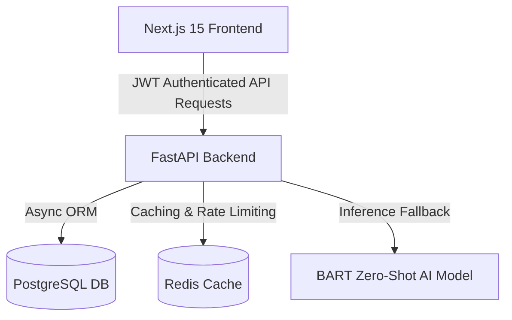

# HelloHealth - AI Symptoms Analyzer

[](https://github.com/rajrathaur4905/HelloHealth/actions/workflows/ci.yml)

A modern, production-grade web application that helps users analyze health symptoms using Zero-Shot AI Classification. It provides instant information about possible conditions, severity levels, treatments, and recommendations on when to seek professional medical care.

---

## 🏗️ Architecture Overview

HelloHealth is built as a decoupled, multi-service application:



* **Frontend**: Next.js 15 (App Router) styled with Tailwind CSS, supporting seamless Light/Dark mode transitions, dynamic state handling, and client-side route protection.
* **Backend**: FastAPI (Python 3.11) exposing secure, asynchronous REST endpoints, integrated with SQLAlchemy (asyncpg) and SlowAPI for rate limiting.
* **Database**: PostgreSQL for persistent user and symptom query history management, version-controlled with Alembic migrations.
* **Cache & Rate Limiting**: Redis for storing symptom check results to reduce model load and managing API request limits.

---

## 📁 Project Structure

```
Prog_Directory/
├── .github/workflows/
│   └── ci.yml              # GitHub Actions CI lint & test pipeline
├── Frontend/               # Next.js 15 Web Application
│   ├── src/
│   │   ├── app/            # App Router (pages: login, register, symptoms, history, dashboard)
│   │   ├── components/     # Reusable UI components (Navbar, Footer, ThemeProvider)
│   │   └── lib/            # Centralized API client (Axios with JWT interceptors)
│   └── tailwind.config.ts  # Theme & styling configuration
├── Backend/                # FastAPI Microservice
│   ├── app/
│   │   ├── middleware/     # Custom rate limiters, Request IDs, and logging
│   │   ├── routers/        # Endpoint routers (auth, symptoms, health)
│   │   ├── models/         # SQLAlchemy DB models
│   │   └── schemas/        # Pydantic schemas for request/response validation
│   ├── alembic/            # Database migration scripts
│   ├── tests/              # Pytest test suite (health checks & symptom classification)
│   ├── Dockerfile          # Multi-stage secure Docker build
│   └── docker-compose.yml  # Local services orchestration
└── render.yaml             # Render deployment blueprint spec
```

---

## 🚀 Quick Start (Docker Setup)

The easiest way to spin up the database, cache, and backend locally is using Docker Compose.

### Prerequisites
* [Docker Desktop](https://www.docker.com/products/docker-desktop/) installed and running.

### Spin Up Services
Navigate to the `Backend` directory and start the services:

```bash
cd Backend
docker compose up -d
```

This starts:
1. **PostgreSQL** on port `5433` (internal `5432`)
2. **Redis** on port `6380` (internal `6379`)
3. **FastAPI Backend** on port `8000` (runs migrations automatically)

You can view the interactive API documentation at: `http://localhost:8000/docs`

---

## 🛠️ Manual Development Setup

If you wish to run the backend and frontend separately for local development:

### 1. Backend Setup
1. Navigate to the `Backend` folder:
   ```bash
   cd Backend
   ```
2. Create and activate a Python virtual environment:
   ```bash
   python -m venv venv
   # Windows
   .\venv\Scripts\activate
   # macOS/Linux
   source venv/bin/activate
   ```
3. Install dependencies:
   ```bash
   pip install -r requirements-dev.txt
   ```
4. Copy the environment template and set your secrets:
   ```bash
   cp .env.example .env
   ```
5. Apply database migrations:
   ```bash
   alembic upgrade head
   ```
6. Start the FastAPI development server:
   ```bash
   uvicorn app.main:create_app --reload --factory
   ```

### 2. Frontend Setup
1. Navigate to the `Frontend` folder:
   ```bash
   cd Frontend
   ```
2. Install npm packages:
   ```bash
   npm install
   ```
3. Copy environment configurations:
   ```bash
   cp .env.example .env.local
   ```
4. Run the Next.js development server:
   ```bash
   npm run dev
   ```
5. Open `http://localhost:3000` in your web browser.

---

## 🧪 Running Tests & Linting

We maintain a high quality of code with automated test coverage and strict formatting checks.

### Run Backend Unit Tests
Inside the `Backend/` directory (with virtual environment active):
```bash
python -m pytest --cov=app
```

### Run Ruff Linter Check
```bash
ruff check .
```

---

## 🌐 Deployment Configuration

HelloHealth is pre-configured for modern hosting platforms:

* **Backend & Infrastructure**: Deploy via **Render** using the provided [render.yaml](render.yaml) blueprint file (deploys PostgreSQL database, Redis cache instance, and the containerized FastAPI backend automatically).
* **Frontend**: Deploy via **Vercel** with automatic deployment on git push. Set `NEXT_PUBLIC_API_URL` to point to your backend service on Render.

---

## 🛡️ Security Features
* **Rate Limiting**: Integrated `slowapi` checks to limit registration/login to `5 req/min` and symptom lookups to `30 req/min`.
* **JWT Authentication**: Secure stateless authentication using JSON Web Tokens with password hashing via `bcrypt`.
* **Secure Containers**: The backend Docker image runs as a non-root `appuser` (UID `10001`) preventing privilege escalation.

---

## ⚠️ Medical Disclaimer
This application is for **educational and research purposes only** and does NOT substitute for professional medical advice, diagnosis, or treatment. Always consult a qualified healthcare provider for medical concerns. In case of emergency, contact your local emergency services (e.g., 911) immediately.
